# Parallel Arc System for Multiplayer Story Engine

Create a system where players in a multiplayer party can be split into subgroups experiencing simultaneous, independent story arcs that later converge back together.

> [!IMPORTANT]
> **One JSON = One Complete Story** - A single story JSON contains the entire narrative flow including all players together, arc splits, parallel paths, and merge points. The story dynamically routes players through different sections based on arc assignments.

## Key Design Goals

1. **Dynamic Player Splits** - Support any split configuration (2-2, 3-1, 1-3, 1-1-2, etc.) based on party size
2. **Author-Controlled Splits** - Story authors define split mode (`role_based` or `random`), players don't choose
3. **Simultaneous Scenes** - Each subgroup sees their own story content at the same time
4. **Arc Convergence** - Arcs merge back at defined "merge points"
5. **Solo Arc Mechanics** - When a player is alone in an arc, use solo mechanics (no voting)
6. **Story-Level Validation** - Validate party size against story requirements
7. **State Isolation** - Choices within an arc are scoped to that arc's participants
8. **Full Feature Parity** - All node types (puzzles, minigames, relationships, etc.) available in all arcs

---

## Node Type Behavior in Arcs

All 8 existing builders work in both solo and group arcs. The key difference is **input collection**:

| Node Type | Solo Arc (1 player) | Group Arc (2+ players) |
|-----------|---------------------|------------------------|
| `narrative` | Shows embed, continue button | Same for all arc players |
| `choice` | Direct selection | **Voting** - outcome by majority/first/etc. |
| `timed` | Direct selection with timer | **Voting** with shared timer |
| `sequence` (puzzle) | Player solves alone | **Collaborative** - any player can add steps |
| `memory` | Player answers alone | **Any player** can submit answer |
| `combat` | Solo combat mechanics | **Cooperative** - players take turns |
| `social` | Direct approach selection | **Voting** on approach |
| `dm` | Private info based on role | **Arc-scoped** - only to arc players with role |

### DM (Private Messages) in Arcs

The `dm` node type and `dm_deliveries` side effect are **arc-aware**:

- **Role-based delivery**: DMs go to players with `recipient_role` matching their party role
- **Arc-scoped**: In an arc, only players **within that arc** can receive DMs (not players in other arcs)
- **Solo arc**: The solo player receives DM if their role matches

```typescript
// Arc-aware DM delivery (updated in side-effects.ts)
function findPlayersWithRole(role, currentPlayerId, party, arcId?) {
  if (arcId) {
    // Only search players in the same arc
    const arcPlayers = getArcPlayers(party.id, arcId);
    return arcPlayers.filter(p => getPartyRole(p) === role);
  }
  // ... existing logic
}
```

### Arc-Scoped State

Each arc maintains its own state that gets merged on arc completion:

| State Type | Behavior |
|------------|----------|
| `choices` | Recorded per-player, tagged with arcId |
| `flags` | Set per-player, can be arc-specific or global |
| `resources` | Arc-scoped (separate pools) or shared (party-wide) |
| `inventory` | Per-player (travels with player between arcs) |
| `combat_states` | Arc-scoped (each arc has own combat instance) |
| `sequence/memory` | Arc-scoped (puzzle state per arc) |

> [!NOTE]
> The arc system extends existing mechanics - it doesn't replace them. All builders receive an `arcContext` in their request context to know which arc they're operating in.

---

## Proposed Changes

### Story-Level Schema

#### [MODIFY] Story JSON Root

Add party size validation at story level:

```json
{
  "id": "the-haunted-manor",
  "title": "The Haunted Manor",
  "min_party_size": 2,           // Minimum players required
  "max_party_size": 4,           // Maximum players allowed
  "supports_solo": false,        // Whether story can be played solo
  "firstNodeId": "intro",
  "nodes": { ... }
}
```

---

### Bot Types Extension

#### [MODIFY] [types.ts](file:///Applications/Code/nodejs/yunami-bot/bot/src/engine/types.ts)

Add new types for arc system:

```typescript
// Arc split node type
export type NodeType = ... | 'arc_split' | 'arc_merge';

// Arc definition in a split node
export interface ArcDefinition {
  id: string;                    // e.g., "team_alpha", "solo_scout"
  label: string;                 // Display name: "Investigation Team"
  description?: string;          // What this arc is about
  player_count: number | 'remaining';  // Exact count or "remaining" for last arc
  entry_node_id: string;         // First node of this arc
  required_roles?: string[];     // Roles required for this arc (e.g., ["scout"])
  preferred_roles?: string[];    // Roles preferred but not required
}

// Arc split configuration (author-controlled, no player choice)
export interface ArcSplitConfig {
  split_mode: 'role_based' | 'random';  // How to assign players
  arcs: ArcDefinition[];
  merge_node_id: string;         // Node where all arcs converge
}

// Add to TypeSpecific interface
export interface TypeSpecific {
  // ... existing fields
  arc_split?: ArcSplitConfig;
  arc_context?: ArcContext;      // Added to nodes within an arc
}

// Arc context for nodes inside an arc
export interface ArcContext {
  arc_id: string;                // Which arc this node belongs to
}

// Extend Preconditions for arc-based rules
export interface Preconditions {
  // ... existing fields
  required_arc?: string;         // Must be in this arc to see this node
  excluded_arcs?: string[];      // Cannot see if in these arcs
}
```

---

### New Arc Manager Module

#### [NEW] [arc-manager.ts](file:///Applications/Code/nodejs/yunami-bot/bot/src/engine/arc-manager.ts)

Central module for tracking active arcs per party:

```typescript
interface ActiveArc {
  arcId: string;
  arcDefinition: ArcDefinition;
  playerIds: string[];
  currentNodeId: string;
  startedAt: Date;
  status: 'active' | 'waiting_at_merge' | 'completed';
  isSoloArc: boolean;            // true if only 1 player (use solo mechanics)
}

interface PartyArcState {
  partyId: string;
  activeArcs: Map<string, ActiveArc>;  // arcId -> ActiveArc
  playerArcAssignment: Map<string, string>;  // playerId -> arcId
  mergeNodeId: string;
  arcsWaitingAtMerge: Set<string>;
}

// Functions:
// - initArcSplit(partyId, splitConfig, players) -> assigns players to arcs
// - getPlayerArc(partyId, playerId) -> returns current arc
// - getArcPlayers(partyId, arcId) -> returns player IDs in arc
// - updateArcNode(partyId, arcId, nodeId) -> updates arc's current position
// - markArcAtMerge(partyId, arcId) -> arc has reached merge point
// - areAllArcsAtMerge(partyId) -> check if ready to converge
// - mergeArcs(partyId) -> converge arcs back to single party flow
```

---

### Party Session Updates

#### [MODIFY] [party.ts](file:///Applications/Code/nodejs/yunami-bot/bot/src/types/party.ts)

```diff
+export type ArcAssignment = {
+  arcId: string;
+  assignedAt: Date;
+};

export type PartyPlayer = {
  odId: string;
  username: string;
  joinedAt: Date;
  isReady: boolean;
  playerSession?: string;
  role?: string;
+  currentArc?: ArcAssignment;
};

export type MultiplayerSession = {
  // ... existing fields
+  arcState?: PartyArcState;      // Present when party is in arc split
+  inArcSplit: boolean;           // Quick flag to check if arcs are active
};
```

---

### Player Session Updates

#### [MODIFY] [runtime-graph.ts](file:///Applications/Code/nodejs/yunami-bot/bot/src/quickstart/runtime-graph.ts)

```diff
export type PlayerSession = {
  // ... existing fields
+  currentArcId?: string;           // Which arc player is currently in
+  arcNodeHistory: Map<string, string[]>;  // arcId -> visited nodes in that arc
};
```

---

### Arc Split Builder

#### [NEW] [arc-split-builder.ts](file:///Applications/Code/nodejs/yunami-bot/bot/src/engine/builders/arc-split-builder.ts)

Handles rendering the arc split and auto-assignment:

- **role_based mode**: Assigns players based on their roles matching `required_roles`/`preferred_roles`
- **random mode**: Randomly distributes players across arcs respecting `player_count`
- Shows a brief "splitting up" narrative embed, then routes each player to their arc's `entry_node_id`
- Marks arcs with only 1 player as `isSoloArc: true` for solo mechanics

---

### Arc Merge Handler

#### [NEW] [arc-merge-handler.ts](file:///Applications/Code/nodejs/yunami-bot/bot/src/engine/arc-merge-handler.ts)

Handles arc convergence:

- Detects when a player/arc reaches a merge node
- Shows "waiting for other teams" embed if not all arcs ready
- Triggers merge when all arcs are at merge point
- Combines arc state/choices into unified party state
- Resumes normal party flow

---

### Dispatcher Updates

#### [MODIFY] [dispatcher.ts](file:///Applications/Code/nodejs/yunami-bot/bot/src/engine/dispatcher.ts)

Add arc-aware node rendering:

```diff
export async function renderNodeWithContext(
  node: StoryNode,
  context: ChoiceBuilderContext,
  nextNodeId?: string
): Promise<BuilderResult> {
+  // Check if this is an arc-specific node
+  if (node.type_specific?.arc_context) {
+    const playerArc = getPlayerArc(context.party?.id, context.playerId);
+    if (playerArc !== node.type_specific.arc_context.arc_id) {
+      throw new Error('Player not in correct arc for this node');
+    }
+  }

  switch (node.type) {
    // ... existing cases
+   case 'arc_split':
+     return buildArcSplitNode(node, context);
+   case 'arc_merge':
+     return handleArcMerge(node, context);
  }
}
```

---

### Button Handler Updates

#### [MODIFY] [engine-choice-handler.ts](file:///Applications/Code/nodejs/yunami-bot/bot/src/buttonhandlers/engine-choice-handler.ts)

Make choice handling arc-aware:

```diff
+const playerArc = getPlayerArc(party?.id, discordId);
+const arcInfo = playerArc ? getActiveArc(party?.id, playerArc) : null;
+
+// If solo arc, skip voting mechanics
+if (arcInfo?.isSoloArc) {
+  // Direct choice processing without voting
+  await api.submitChoice(discordId, storyId, nodeId, choiceId, nextNodeId);
+} else if (playerArc) {
+  // Record choice scoped to arc group for voting
+  recordPlayerInput(nodeId, discordId, { choiceId }, party?.id, playerArc);
+}
```

> [!NOTE]
> Since splits are author-controlled (not player choice), no `arc-choice-handler.ts` is needed. The `arc-split-builder` handles auto-assignment and immediately routes players.

---

### JSON Schema Example

Here's a complete story with all players → arc split → parallel arcs → merge → all players:

```json
{
  "id": "the-investigation",
  "title": "The Investigation",
  "min_party_size": 2,
  "max_party_size": 4,
  "supports_solo": false,
  "firstNodeId": "intro",
  "nodes": {
    "intro": {
      "id": "intro",
      "schema_version": 1,
      "type": "narrative",
      "title": "All Together",
      "public_embed": {
        "title": "🏚️ The Manor",
        "description": "Your team arrives at the manor together..."
      },
      "type_specific": {
        "extra_data": { "nextNodeId": "group_splits" }
      }
    },
    "group_splits": {
      "id": "group_splits",
      "schema_version": 1,
      "type": "arc_split",
      "title": "The Group Divides",
      "public_embed": {
        "title": "⚔️ Time to Split Up",
        "description": "The path ahead forks. Your group must divide to cover more ground.",
        "color": 10181046
      },
      "type_specific": {
        "arc_split": {
          "split_mode": "role_based",
          "merge_node_id": "reunion",
          "arcs": [
            {
              "id": "solo_scout",
              "label": "Scout Mission",
              "description": "The scout goes ahead alone",
              "player_count": 1,
              "entry_node_id": "scout_start",
              "required_roles": ["scout"]
            },
            {
              "id": "main_team",
              "label": "Main Team",
              "description": "The rest of the team stays together",
              "player_count": "remaining",
              "entry_node_id": "team_start"
            }
          ]
        }
      }
    },
    "scout_start": {
      "id": "scout_start",
      "schema_version": 1,
      "type": "choice",
      "title": "Scout Solo",
      "type_specific": {
        "arc_context": { "arc_id": "solo_scout" },
        "choices": [
          { "id": "sneak", "label": "Sneak ahead", "nextNodeId": "scout_sneak" },
          { "id": "observe", "label": "Observe first", "nextNodeId": "scout_observe" }
        ]
      },
      "public_embed": {
        "title": "🔦 Alone in the Dark",
        "description": "You're on your own now. What do you do?"
      }
    },
    "scout_sneak": {
      "id": "scout_sneak",
      "schema_version": 1,
      "type": "narrative",
      "type_specific": {
        "arc_context": { "arc_id": "solo_scout" },
        "extra_data": { "nextNodeId": "reunion" }
      },
      "public_embed": {
        "title": "🤫 Sneaking...",
        "description": "You move silently through the shadows..."
      }
    },
    "team_start": {
      "id": "team_start",
      "schema_version": 1,
      "type": "timed",
      "title": "Team Decision",
      "type_specific": {
        "arc_context": { "arc_id": "main_team" },
        "timers": { "duration_seconds": 30 },
        "choices": [
          { "id": "careful", "label": "Move carefully", "nextNodeId": "team_careful" },
          { "id": "rush", "label": "Rush forward", "nextNodeId": "team_rush" }
        ],
        "outcome_rules": { "on_all_inputs_or_timeout": { "compute": "majority" } }
      },
      "public_embed": {
        "title": "⏱️ Team Vote",
        "description": "Your team must decide together!"
      }
    },
    "reunion": {
      "id": "reunion",
      "schema_version": 1,
      "type": "arc_merge",
      "title": "Reunion",
      "public_embed": {
        "title": "🤝 The Team Reunites",
        "description": "Everyone has returned. The scout shares what they found..."
      },
      "type_specific": {
        "extra_data": { "nextNodeId": "finale" }
      }
    },
    "finale": {
      "id": "finale",
      "schema_version": 1,
      "type": "narrative",
      "title": "Finale",
      "public_embed": {
        "title": "🎬 The End",
        "description": "Together again, your team faces the final challenge..."
      }
    }
  }
}
```

---

## Story Flow Visualization


---

## Key Interaction Flows

### Arc Split Flow (Author-Controlled)

```mermaid
sequenceDiagram
    participant P1 as Player 1 (Scout)
    participant P2 as Player 2
    participant P3 as Player 3
    participant Bot
    participant ArcMgr as Arc Manager
    
    Note over Bot: arc_split node reached
    ArcMgr->>ArcMgr: role_based assignment
    ArcMgr->>ArcMgr: P1 has Scout role → solo_scout arc
    ArcMgr->>ArcMgr: P2, P3 → main_team arc
    ArcMgr->>ArcMgr: solo_scout.isSoloArc = true
    
    Bot->>P1: "Splitting up" embed → scout_start (solo)
    Bot->>P2: "Splitting up" embed → team_start (with P3)
    Bot->>P3: "Splitting up" embed → team_start (with P2)
```



### During Arc Execution

- Each arc operates independently with its own `currentNodeId`
- **Solo arcs**: Direct choice processing, no voting needed
- **Group arcs**: Voting (for timed nodes) happens within arc group only
- Arc choices/outcomes are saved to backend with `arcId` context

### Arc Merge Flow


---

## Summary of Design Decisions

| Item | Decision |
|------|----------|
| Split Modes | `role_based` and `random` only (author-controlled) |
| Role Fallback | If no player has required role, **fall back to random** assignment |
| Solo Arcs | Use solo mechanics (no voting) when arc has 1 player |
| Party Size | Story-level `min_party_size`/`max_party_size` validation |
| Arc State | **Persisted to backend** for durability |
| Nesting | **Single-level only** (no arcs within arcs) |
| One JSON | Contains complete story: all players → splits → arcs → merge → all players |
| Test Story | Create sample JSON with parallel arcs for testing |

---

## Verification Plan

### Manual Verification

1. **Create Test Story**: Sample story JSON with:
   - Intro node (all players together)
   - Arc split node (1 solo arc + 1 group arc)
   - 2-3 nodes per arc with choices/voting
   - Merge point
   - Finale node (all players together again)

2. **Test with 2 Players** (1-1 split):
   - Player with Scout role goes to solo arc (no voting)
   - Other player in "group" arc (solo in this case, but treated as group)
   - Verify each sees only their arc content
   - Verify merge waits for both

3. **Test with 4 Players** (1-3 split):
   - Scout goes to solo arc
   - 3 others in main_team arc with voting
   - Verify voting works within the 3-player group
   - Verify scout has immediate choice processing

4. **Test random split mode**:
   - Story with `split_mode: "random"`
   - Verify players are distributed correctly
